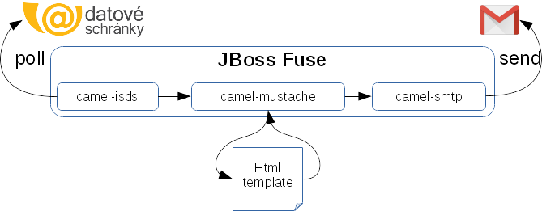
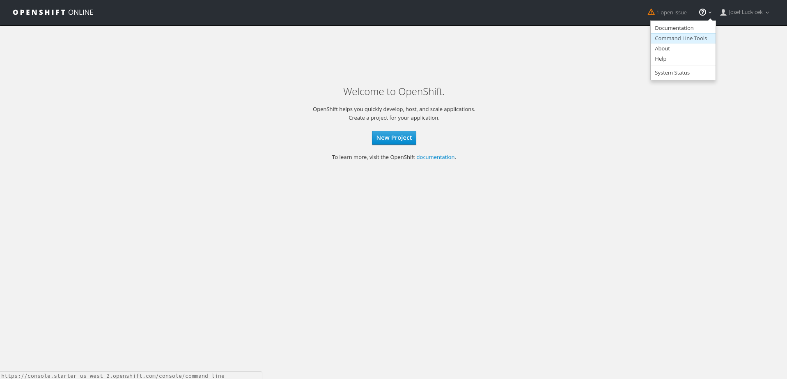
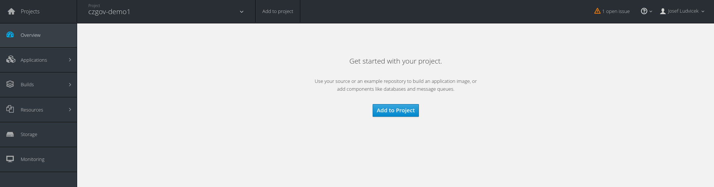
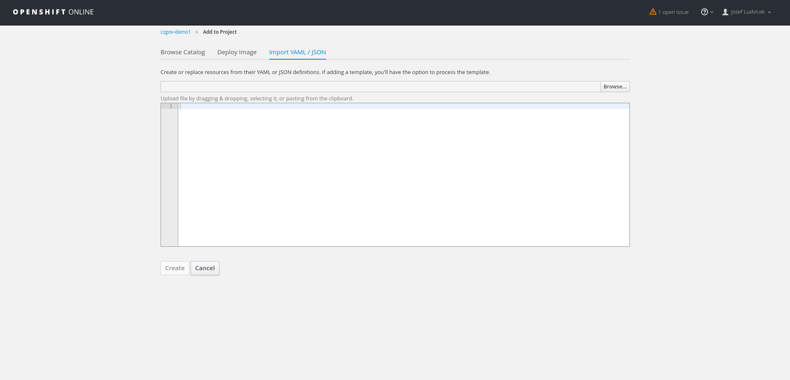

# ISDS Gmail Example
Demo application which simply "forwards" messages from your databox to your Gmail.

This demo is written using spring boot and it's ready for deployment into [OpenShift v3](https://www.openshift.com/).  
There is also [demo](https://github.com/czgov/isds-gmail-example) showing deployment into JBoss Fuse 6.3.

It will poll for new messages from "Informační Systém Datových Schránek" (shortcut ISDS)
and send every received message to e-mail address you specify as recipient.



## Getting Access to ISDS
See section [getting access](https://github.com/czgov/camel-isds#getting-access-to-isds)
of underlying [Camel ISDS](https://github.com/czgov/camel-isds) component.

## Running locally
```bash
git clone https://github.com/czgov/isds-gmail-example-spring-boot.git

cd isds-gmail-example-spring-boot

mvn clean install spring-boot:run
```

## Running on Openshift
First we need to have some project for testing applications.

One can create on OpenShift "welcome screen".  
Note there is also link to install command line tools in top right corner.




Easiest way to deploy the application is to use prepared template.

Template can be imported to Openshift via command line:
```bash
oc create -f https://raw.githubusercontent.com/czgov/isds-gmail-example-spring-boot/master/openshift-template.yml
```

Another way is to use Openshift web console to import template.

One would click "Add to project"


and copy-paste content of [openshift-template.yml](openshift-template.yml) here:


Last step is to fill login credentials for ISDS and for your Gmail account
and start application.

App can be created also from command line (replace `${PARAM}` with appropriate values):
```bash
oc new-app isds-gmail-example-spring-boot \
	-p ISDS_ENV=PRODUCTION \
	-p ISDS_LOGIN=${ISDS_LOGIN} \
	-p ISDS_PASSWORD=${ISDS_PASSWORD} \
	-p GMAIL_LOGIN=${GMAIL_LOGIN} \
	-p GMAIL_RECIPIENT=${GMAIL_RECIPIENT} \
	-p GMAIL_PASSWORD=${GMAIL_PASSWORD}
```
